# BrandSnap Frontend - Visual Guide 📊

This visual guide complements the Beginner's Guide with diagrams and flowcharts to help you understand how the BrandSnap frontend works.

## 📚 Table of Contents

1. [Application Architecture](#application-architecture)
2. [Component Hierarchy](#component-hierarchy)
3. [Data Flow](#data-flow)
4. [User Journey Maps](#user-journey-maps)
5. [Authentication Flow](#authentication-flow)
6. [API Communication](#api-communication)
7. [State Management](#state-management)
8. [Routing Flow](#routing-flow)

---

## 🏗️ Application Architecture

### High-Level Architecture

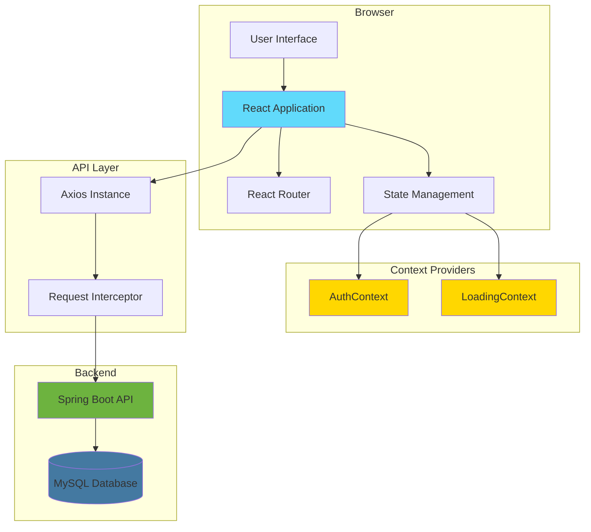
```mermaid
graph TB
    subgraph "Browser"
        UI[User Interface]
        React[React Application]
        Router[React Router]
        State[State Management]
    end

    subgraph "Context Providers"
        Auth[AuthContext]
        Loading[LoadingContext]
    end

    subgraph "API Layer"
        Axios[Axios Instance]
        Interceptor[Request Interceptor]
    end

    subgraph "Backend"
        API[Spring Boot API]
        DB[(MySQL Database)]
    end

    UI --> React
    React --> Router
    React --> State
    State --> Auth
    State --> Loading
    React --> Axios
    Axios --> Interceptor
    Interceptor --> API
    API --> DB

    style React fill:#61dafb
    style Auth fill:#ffd700
    style Loading fill:#ffd700
    style API fill:#6db33f
    style DB fill:#4479a1
```

### Technology Stack Layers

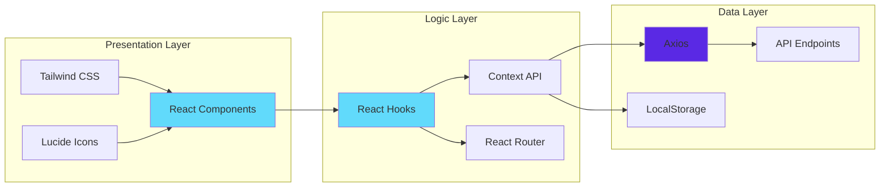
```mermaid
graph LR
    subgraph "Presentation Layer"
        A[React Components]
        B[Tailwind CSS]
        C[Lucide Icons]
    end

    subgraph "Logic Layer"
        D[React Hooks]
        E[Context API]
        F[React Router]
    end

    subgraph "Data Layer"
        G[Axios]
        H[LocalStorage]
        I[API Endpoints]
    end

    A --> D
    B --> A
    C --> A
    D --> E
    D --> F
    E --> G
    E --> H
    G --> I

    style A fill:#61dafb
    style D fill:#61dafb
    style G fill:#5a29e4
```

---

## 🧩 Component Hierarchy

### Complete Component Tree

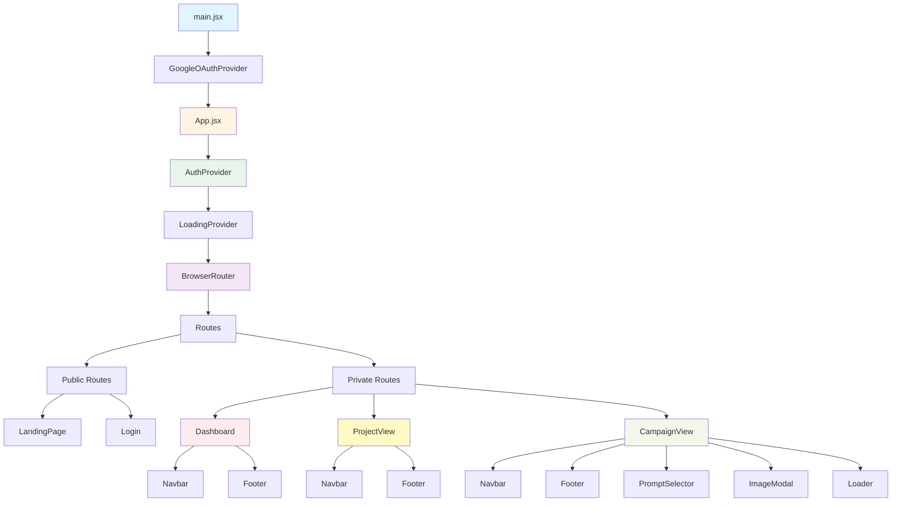
```mermaid
graph TB
    Main[main.jsx]
    Main --> GoogleProvider[GoogleOAuthProvider]
    GoogleProvider --> App[App.jsx]

    App --> AuthProvider[AuthProvider]
    AuthProvider --> LoadingProvider[LoadingProvider]
    LoadingProvider --> Router[BrowserRouter]

    Router --> Routes[Routes]

    Routes --> PublicRoutes[Public Routes]
    Routes --> PrivateRoutes[Private Routes]

    PublicRoutes --> Landing[LandingPage]
    PublicRoutes --> Login[Login]

    PrivateRoutes --> Dashboard[Dashboard]
    PrivateRoutes --> ProjectView[ProjectView]
    PrivateRoutes --> CampaignView[CampaignView]

    Dashboard --> Navbar1[Navbar]
    Dashboard --> Footer1[Footer]

    ProjectView --> Navbar2[Navbar]
    ProjectView --> Footer2[Footer]

    CampaignView --> Navbar3[Navbar]
    CampaignView --> Footer3[Footer]
    CampaignView --> PromptSelector[PromptSelector]
    CampaignView --> ImageModal[ImageModal]
    CampaignView --> Loader[Loader]

    style Main fill:#e1f5ff
    style App fill:#fff4e1
    style AuthProvider fill:#e8f5e9
    style Router fill:#f3e5f5
    style Dashboard fill:#ffebee
    style ProjectView fill:#fff9c4
    style CampaignView fill:#f1f8e9
```

### Page Component Breakdown

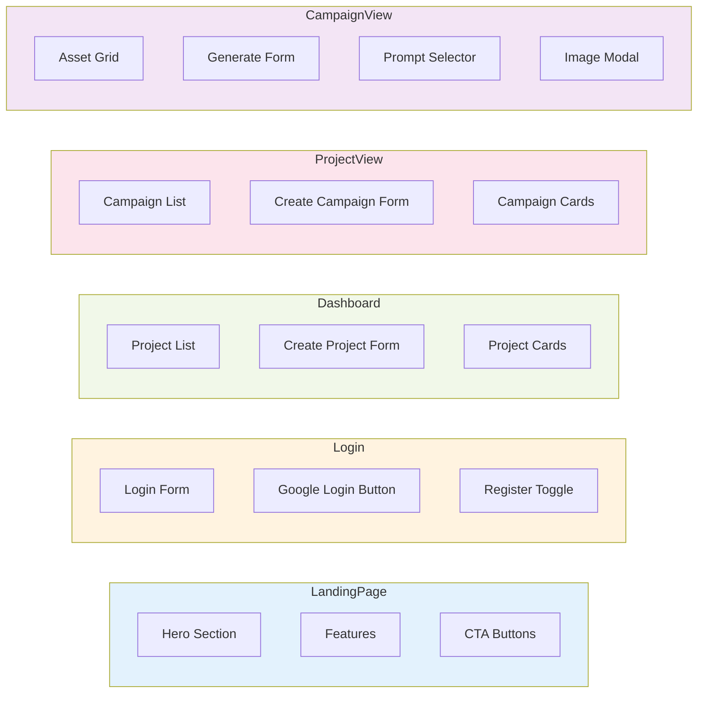
```mermaid
graph LR
    subgraph "LandingPage"
        LP1[Hero Section]
        LP2[Features]
        LP3[CTA Buttons]
    end

    subgraph "Login"
        L1[Login Form]
        L2[Google Login Button]
        L3[Register Toggle]
    end

    subgraph "Dashboard"
        D1[Project List]
        D2[Create Project Form]
        D3[Project Cards]
    end

    subgraph "ProjectView"
        P1[Campaign List]
        P2[Create Campaign Form]
        P3[Campaign Cards]
    end

    subgraph "CampaignView"
        C1[Asset Grid]
        C2[Generate Form]
        C3[Prompt Selector]
        C4[Image Modal]
    end

    style LandingPage fill:#e3f2fd
    style Login fill:#fff3e0
    style Dashboard fill:#f1f8e9
    style ProjectView fill:#fce4ec
    style CampaignView fill:#f3e5f5
```

---

## 🔄 Data Flow

### Unidirectional Data Flow

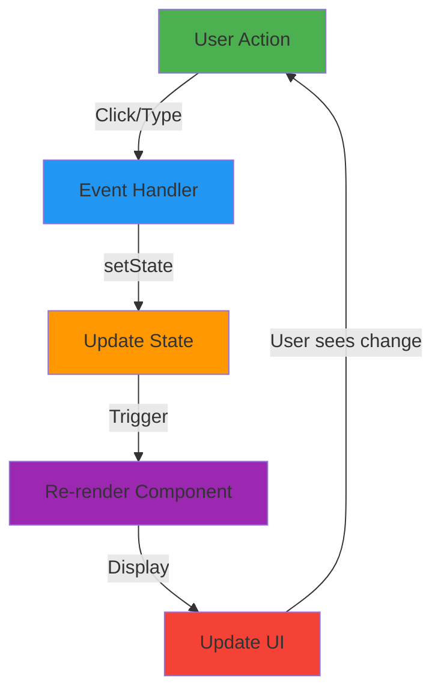
```mermaid
graph TB
    User[User Action]
    Event[Event Handler]
    State[Update State]
    Render[Re-render Component]
    UI[Update UI]

    User -->|Click/Type| Event
    Event -->|setState| State
    State -->|Trigger| Render
    Render -->|Display| UI
    UI -->|User sees change| User

    style User fill:#4caf50
    style Event fill:#2196f3
    style State fill:#ff9800
    style Render fill:#9c27b0
    style UI fill:#f44336
```

### Example: Creating a Project

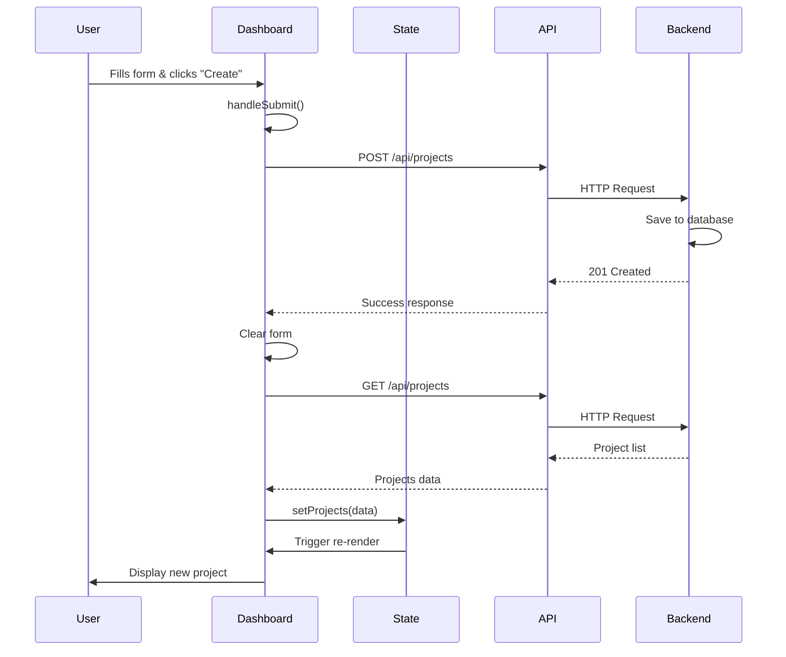
```mermaid
sequenceDiagram
    participant User
    participant Dashboard
    participant State
    participant API
    participant Backend

    User->>Dashboard: Fills form & clicks "Create"
    Dashboard->>Dashboard: handleSubmit()
    Dashboard->>API: POST /api/projects
    API->>Backend: HTTP Request
    Backend->>Backend: Save to database
    Backend-->>API: 201 Created
    API-->>Dashboard: Success response
    Dashboard->>Dashboard: Clear form
    Dashboard->>API: GET /api/projects
    API->>Backend: HTTP Request
    Backend-->>API: Project list
    API-->>Dashboard: Projects data
    Dashboard->>State: setProjects(data)
    State->>Dashboard: Trigger re-render
    Dashboard->>User: Display new project
```

---

## 🗺️ User Journey Maps

### New User Journey

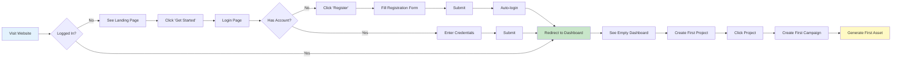
```mermaid
graph LR
    A[Visit Website] --> B{Logged In?}
    B -->|No| C[See Landing Page]
    C --> D[Click 'Get Started']
    D --> E[Login Page]
    E --> F{Has Account?}
    F -->|No| G[Click 'Register']
    G --> H[Fill Registration Form]
    H --> I[Submit]
    I --> J[Auto-login]
    J --> K[Redirect to Dashboard]
    F -->|Yes| L[Enter Credentials]
    L --> M[Submit]
    M --> K
    B -->|Yes| K
    K --> N[See Empty Dashboard]
    N --> O[Create First Project]
    O --> P[Click Project]
    P --> Q[Create First Campaign]
    Q --> R[Generate First Asset]

    style A fill:#e3f2fd
    style K fill:#c8e6c9
    style R fill:#fff9c4
```

### Returning User Journey

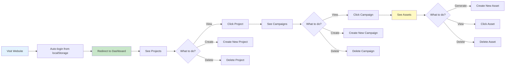
```mermaid
graph LR
    A[Visit Website] --> B[Auto-login from localStorage]
    B --> C[Redirect to Dashboard]
    C --> D[See Projects]
    D --> E{What to do?}
    E -->|View| F[Click Project]
    E -->|Create| G[Create New Project]
    E -->|Delete| H[Delete Project]
    F --> I[See Campaigns]
    I --> J{What to do?}
    J -->|View| K[Click Campaign]
    J -->|Create| L[Create New Campaign]
    J -->|Delete| M[Delete Campaign]
    K --> N[See Assets]
    N --> O{What to do?}
    O -->|Generate| P[Create New Asset]
    O -->|View| Q[Click Asset]
    O -->|Delete| R[Delete Asset]

    style A fill:#e3f2fd
    style C fill:#c8e6c9
    style N fill:#fff9c4
```

---

## 🔐 Authentication Flow

### Login Flow (Traditional)

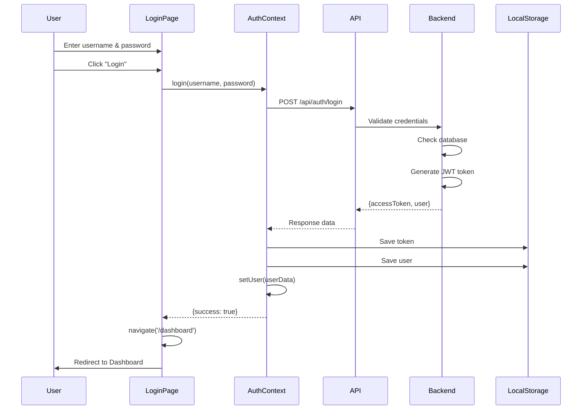
```mermaid
sequenceDiagram
    participant User
    participant LoginPage
    participant AuthContext
    participant API
    participant Backend
    participant LocalStorage

    User->>LoginPage: Enter username & password
    User->>LoginPage: Click "Login"
    LoginPage->>AuthContext: login(username, password)
    AuthContext->>API: POST /api/auth/login
    API->>Backend: Validate credentials
    Backend->>Backend: Check database
    Backend->>Backend: Generate JWT token
    Backend-->>API: {accessToken, user}
    API-->>AuthContext: Response data
    AuthContext->>LocalStorage: Save token
    AuthContext->>LocalStorage: Save user
    AuthContext->>AuthContext: setUser(userData)
    AuthContext-->>LoginPage: {success: true}
    LoginPage->>LoginPage: navigate('/dashboard')
    LoginPage->>User: Redirect to Dashboard
```

### Google OAuth Flow

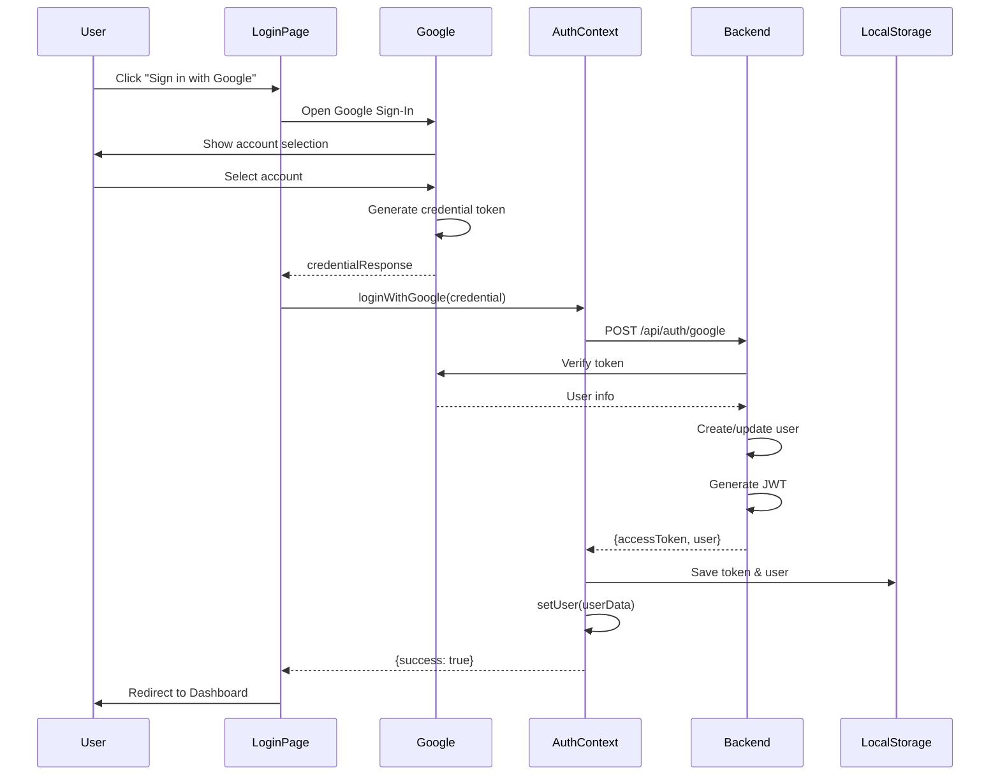
```mermaid
sequenceDiagram
    participant User
    participant LoginPage
    participant Google
    participant AuthContext
    participant Backend
    participant LocalStorage

    User->>LoginPage: Click "Sign in with Google"
    LoginPage->>Google: Open Google Sign-In
    Google->>User: Show account selection
    User->>Google: Select account
    Google->>Google: Generate credential token
    Google-->>LoginPage: credentialResponse
    LoginPage->>AuthContext: loginWithGoogle(credential)
    AuthContext->>Backend: POST /api/auth/google
    Backend->>Google: Verify token
    Google-->>Backend: User info
    Backend->>Backend: Create/update user
    Backend->>Backend: Generate JWT
    Backend-->>AuthContext: {accessToken, user}
    AuthContext->>LocalStorage: Save token & user
    AuthContext->>AuthContext: setUser(userData)
    AuthContext-->>LoginPage: {success: true}
    LoginPage->>User: Redirect to Dashboard
```

### Logout Flow

```mermaid
graph LR
    A[User clicks Logout] --> B[logout function called]
    B --> C[Remove token from localStorage]
    C --> D[Remove user from localStorage]
    D --> E[setUser null]
    E --> F[State updates]
    F --> G[Components re-render]
    G --> H[PrivateRoute checks user]
    H --> I[user is null]
    I --> J[Navigate to /login]

    style A fill:#f44336
    style J fill:#4caf50
```

### Session Persistence

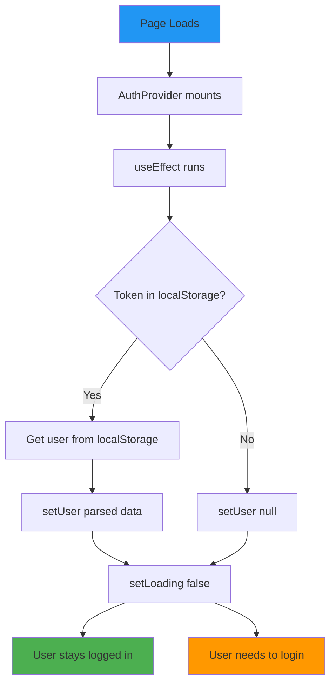
```mermaid
graph TB
    A[Page Loads] --> B[AuthProvider mounts]
    B --> C[useEffect runs]
    C --> D{Token in localStorage?}
    D -->|Yes| E[Get user from localStorage]
    E --> F[setUser parsed data]
    F --> G[setLoading false]
    G --> H[User stays logged in]
    D -->|No| I[setUser null]
    I --> G
    G --> J[User needs to login]

    style A fill:#2196f3
    style H fill:#4caf50
    style J fill:#ff9800
```

---

## 🌐 API Communication

### Axios Instance Setup

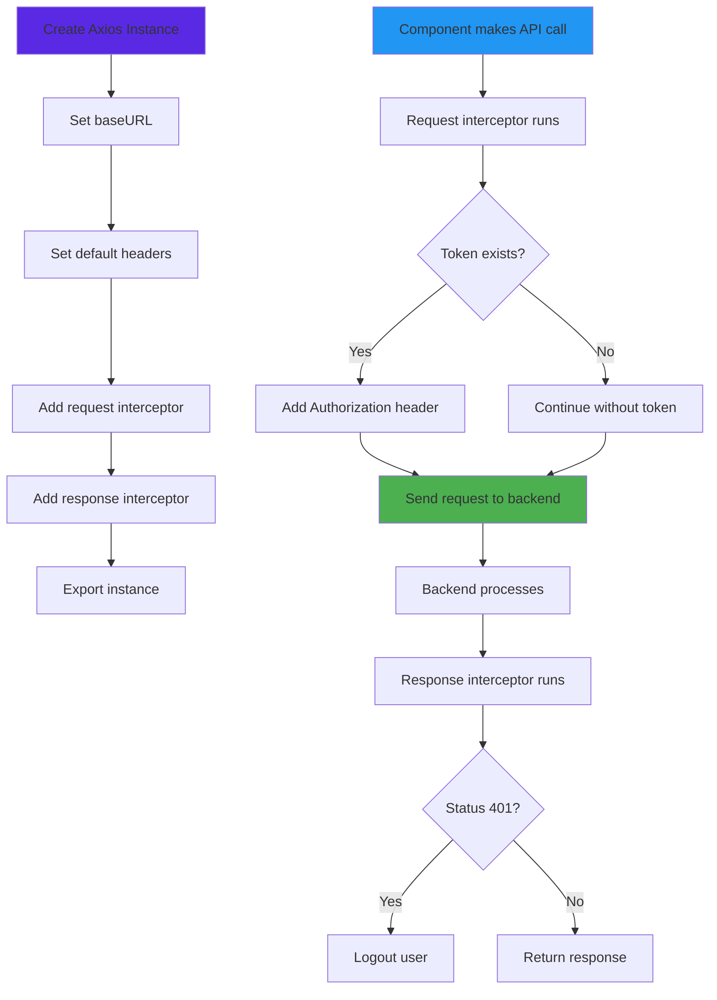
```mermaid
graph TB
    A[Create Axios Instance] --> B[Set baseURL]
    B --> C[Set default headers]
    C --> D[Add request interceptor]
    D --> E[Add response interceptor]
    E --> F[Export instance]

    G[Component makes API call] --> H[Request interceptor runs]
    H --> I{Token exists?}
    I -->|Yes| J[Add Authorization header]
    I -->|No| K[Continue without token]
    J --> L[Send request to backend]
    K --> L
    L --> M[Backend processes]
    M --> N[Response interceptor runs]
    N --> O{Status 401?}
    O -->|Yes| P[Logout user]
    O -->|No| Q[Return response]

    style A fill:#5a29e4
    style G fill:#2196f3
    style L fill:#4caf50
```

### API Request Flow

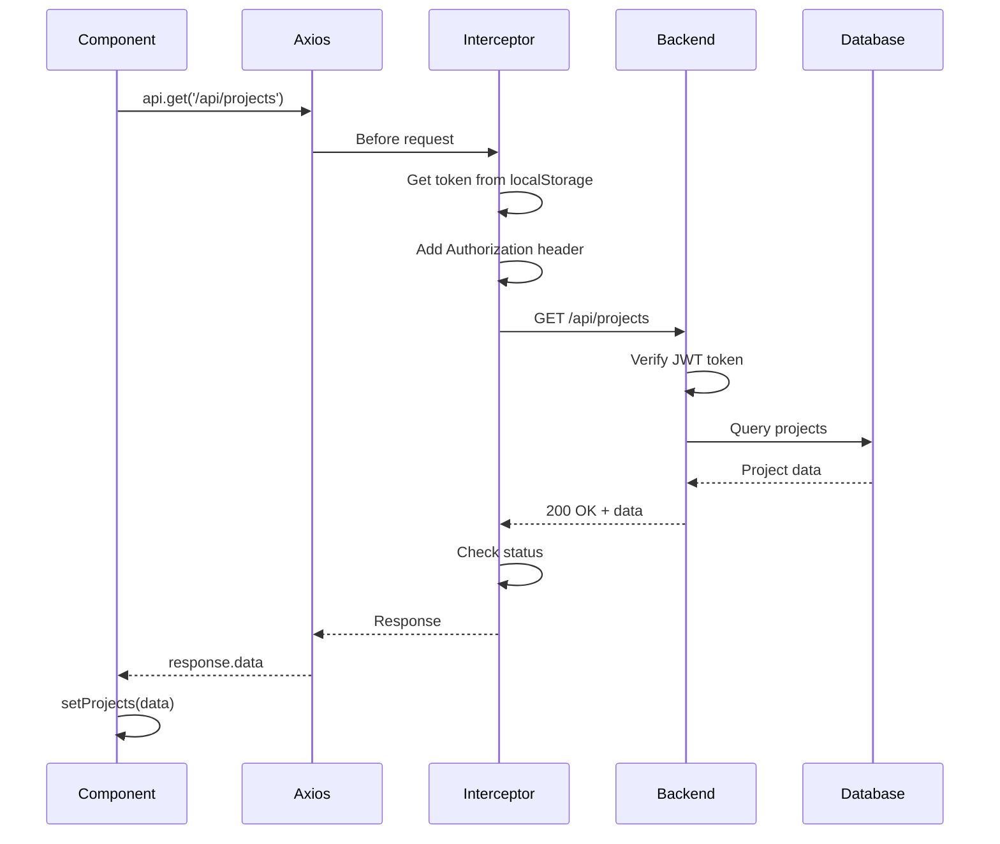
```mermaid
sequenceDiagram
    participant Component
    participant Axios
    participant Interceptor
    participant Backend
    participant Database

    Component->>Axios: api.get('/api/projects')
    Axios->>Interceptor: Before request
    Interceptor->>Interceptor: Get token from localStorage
    Interceptor->>Interceptor: Add Authorization header
    Interceptor->>Backend: GET /api/projects
    Backend->>Backend: Verify JWT token
    Backend->>Database: Query projects
    Database-->>Backend: Project data
    Backend-->>Interceptor: 200 OK + data
    Interceptor->>Interceptor: Check status
    Interceptor-->>Axios: Response
    Axios-->>Component: response.data
    Component->>Component: setProjects(data)
```

### Error Handling Flow

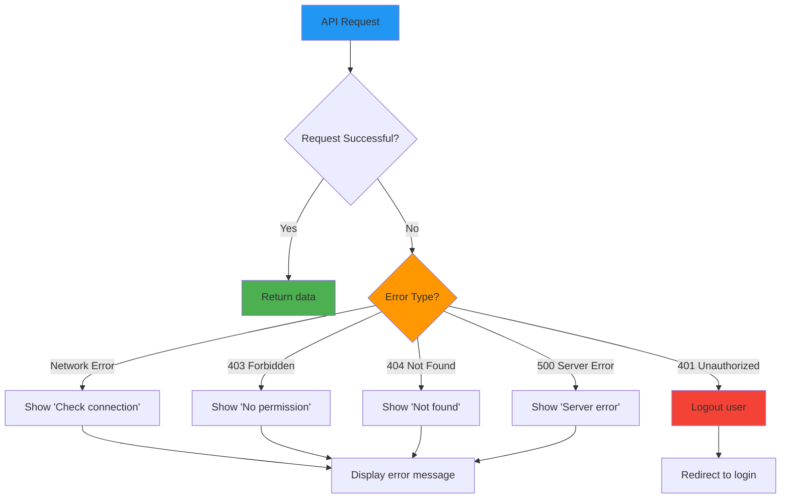
```mermaid
graph TB
    A[API Request] --> B{Request Successful?}
    B -->|Yes| C[Return data]
    B -->|No| D{Error Type?}
    D -->|Network Error| E[Show 'Check connection']
    D -->|401 Unauthorized| F[Logout user]
    D -->|403 Forbidden| G[Show 'No permission']
    D -->|404 Not Found| H[Show 'Not found']
    D -->|500 Server Error| I[Show 'Server error']
    F --> J[Redirect to login]
    E --> K[Display error message]
    G --> K
    H --> K
    I --> K

    style A fill:#2196f3
    style C fill:#4caf50
    style D fill:#ff9800
    style F fill:#f44336
```

---

## 📦 State Management

### Local State (useState)

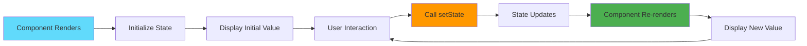
```mermaid
graph LR
    A[Component Renders] --> B[Initialize State]
    B --> C[Display Initial Value]
    C --> D[User Interaction]
    D --> E[Call setState]
    E --> F[State Updates]
    F --> G[Component Re-renders]
    G --> H[Display New Value]
    H --> D

    style A fill:#61dafb
    style E fill:#ff9800
    style G fill:#4caf50
```

### Global State (Context)

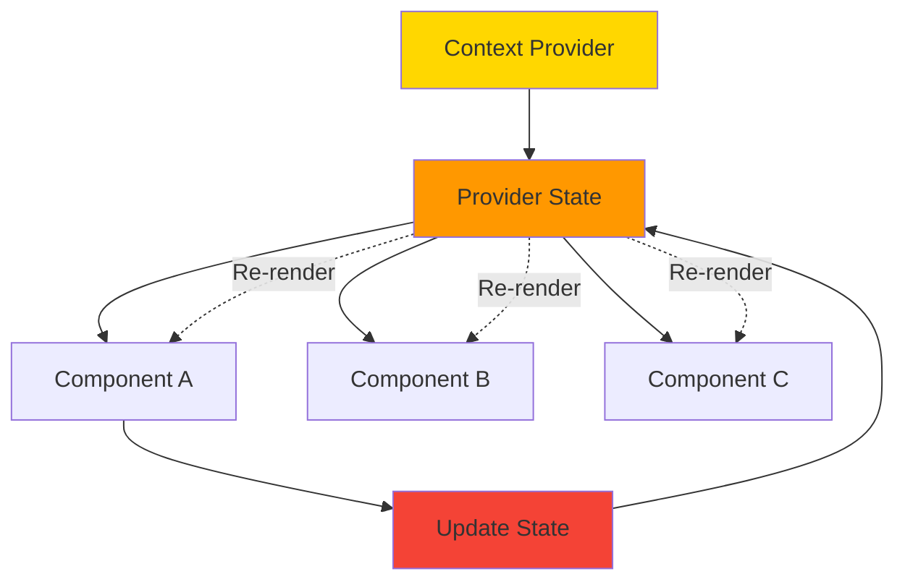
```mermaid
graph TB
    Provider[Context Provider]
    State[Provider State]

    Provider --> State

    State --> C1[Component A]
    State --> C2[Component B]
    State --> C3[Component C]

    C1 --> Update[Update State]
    Update --> State

    State -.->|Re-render| C1
    State -.->|Re-render| C2
    State -.->|Re-render| C3

    style Provider fill:#ffd700
    style State fill:#ff9800
    style Update fill:#f44336
```

### AuthContext State Flow

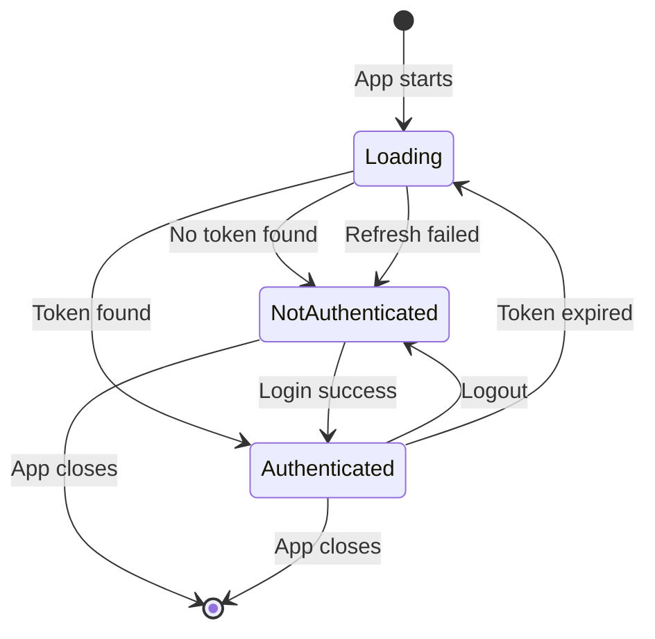
```mermaid
stateDiagram-v2
    [*] --> Loading: App starts
    Loading --> NotAuthenticated: No token found
    Loading --> Authenticated: Token found

    NotAuthenticated --> Authenticated: Login success
    Authenticated --> NotAuthenticated: Logout

    Authenticated --> Loading: Token expired
    Loading --> NotAuthenticated: Refresh failed

    NotAuthenticated --> [*]: App closes
    Authenticated --> [*]: App closes
```

---

## 🛣️ Routing Flow

### Route Decision Tree

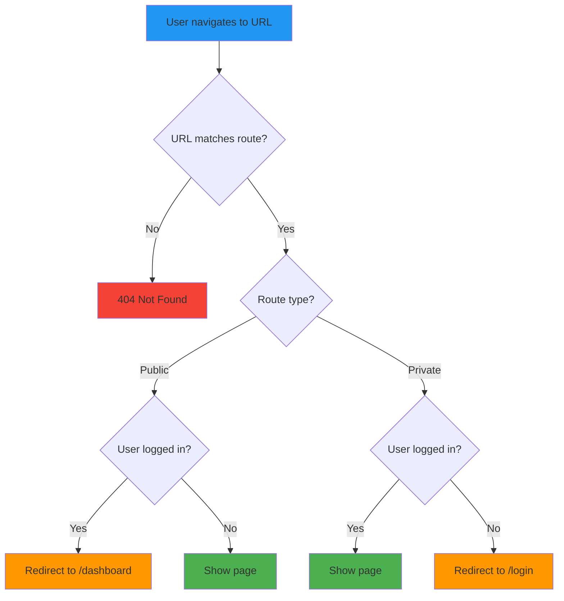
```mermaid
graph TB
    A[User navigates to URL] --> B{URL matches route?}
    B -->|No| C[404 Not Found]
    B -->|Yes| D{Route type?}
    D -->|Public| E{User logged in?}
    D -->|Private| F{User logged in?}

    E -->|Yes| G[Redirect to /dashboard]
    E -->|No| H[Show page]

    F -->|Yes| I[Show page]
    F -->|No| J[Redirect to /login]

    style A fill:#2196f3
    style H fill:#4caf50
    style I fill:#4caf50
    style G fill:#ff9800
    style J fill:#ff9800
    style C fill:#f44336
```

### Navigation Methods

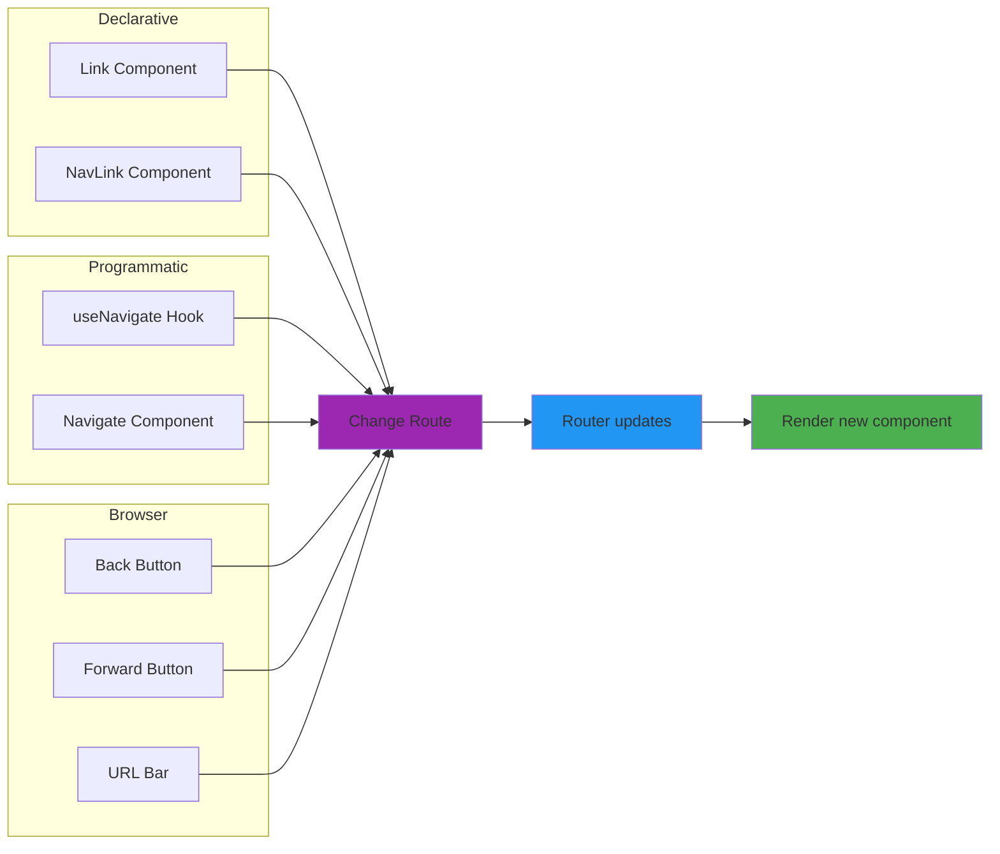
```mermaid
graph LR
    subgraph "Declarative"
        A[Link Component]
        B[NavLink Component]
    end

    subgraph "Programmatic"
        C[useNavigate Hook]
        D[Navigate Component]
    end

    subgraph "Browser"
        E[Back Button]
        F[Forward Button]
        G[URL Bar]
    end

    A --> H[Change Route]
    B --> H
    C --> H
    D --> H
    E --> H
    F --> H
    G --> H

    H --> I[Router updates]
    I --> J[Render new component]

    style H fill:#9c27b0
    style I fill:#2196f3
    style J fill:#4caf50
```

### Complete Routing Flow

```mermaid
sequenceDiagram
    participant User
    participant Browser
    participant Router
    participant RouteGuard
    participant Component

    User->>Browser: Click link or enter URL
    Browser->>Router: URL changed
    Router->>Router: Match URL to route
    Router->>RouteGuard: Check route protection
    RouteGuard->>RouteGuard: Check auth state
    alt User authenticated & route is private
        RouteGuard->>Component: Render component
    else User not authenticated & route is private
        RouteGuard->>Router: Navigate to /login
    else User authenticated & route is public
        RouteGuard->>Router: Navigate to /dashboard
    else User not authenticated & route is public
        RouteGuard->>Component: Render component
    end
    Component->>User: Display page
```

---

## 🎨 Component Lifecycle

### Functional Component Lifecycle

```mermaid
graph TB
    A[Component Called] --> B[Execute function body]
    B --> C[Initialize state & refs]
    C --> D[Return JSX]
    D --> E[React renders to DOM]
    E --> F[useEffect runs]
    F --> G[Component visible]

    G --> H{State/Props change?}
    H -->|Yes| I[Re-execute function]
    I --> J[Return new JSX]
    J --> K[React updates DOM]
    K --> L[useEffect cleanup]
    L --> M[useEffect runs again]
    M --> G

    H -->|No| G

    G --> N[Component unmounts]
    N --> O[useEffect cleanup]
    O --> P[Remove from DOM]

    style A fill:#61dafb
    style E fill:#4caf50
    style K fill:#ff9800
    style P fill:#f44336
```

### useEffect Execution Flow

```mermaid
graph LR
    A[Component Renders] --> B{First render?}
    B -->|Yes| C[Run effect]
    B -->|No| D{Dependencies changed?}
    D -->|Yes| E[Run cleanup]
    D -->|No| F[Skip effect]
    E --> C
    C --> G[Component visible]
    G --> H[Component unmounts]
    H --> I[Run cleanup]

    style A fill:#61dafb
    style C fill:#4caf50
    style E fill:#ff9800
    style I fill:#f44336
```

---

## 📱 Responsive Design Flow

### Tailwind Breakpoints

```mermaid
graph LR
    A[Screen Size] --> B{Width?}
    B -->|< 640px| C[Mobile sm]
    B -->|640px - 768px| D[Tablet md]
    B -->|768px - 1024px| E[Laptop lg]
    B -->|1024px - 1280px| F[Desktop xl]
    B -->|> 1280px| G[Large Desktop 2xl]

    C --> H[Stack vertically]
    D --> I[2 columns]
    E --> J[3 columns]
    F --> K[4 columns]
    G --> K

    style A fill:#2196f3
    style C fill:#f44336
    style D fill:#ff9800
    style E fill:#4caf50
    style F fill:#2196f3
    style G fill:#9c27b0
```

---

## 🔄 Form Handling Flow

### Controlled Component Pattern

```mermaid
sequenceDiagram
    participant User
    participant Input
    participant State
    participant Component

    User->>Input: Types character
    Input->>Input: onChange event
    Input->>Component: Call handler
    Component->>State: setState(newValue)
    State->>Component: Trigger re-render
    Component->>Input: Update value prop
    Input->>User: Display new value
```

### Form Submission Flow

```mermaid
graph TB
    A[User fills form] --> B[User clicks Submit]
    B --> C[onSubmit handler]
    C --> D[e.preventDefault]
    D --> E{Validate input?}
    E -->|Invalid| F[Show errors]
    E -->|Valid| G[Make API call]
    G --> H{Success?}
    H -->|Yes| I[Clear form]
    H -->|No| J[Show error message]
    I --> K[Update state]
    K --> L[Show success message]
    F --> M[User corrects input]
    M --> B
    J --> M

    style A fill:#2196f3
    style G fill:#ff9800
    style I fill:#4caf50
    style J fill:#f44336
```

---

## 🎯 Summary Diagram

### Complete Application Flow

```mermaid
graph TB
    Start([User Opens App]) --> Load[Load main.jsx]
    Load --> Init[Initialize React]
    Init --> Providers[Wrap with Providers]
    Providers --> Auth{Check Auth}

    Auth -->|Not Logged In| Public[Show Public Routes]
    Auth -->|Logged In| Private[Show Private Routes]

    Public --> Landing[Landing Page]
    Public --> Login[Login Page]

    Login --> DoLogin[User Logs In]
    DoLogin --> SaveToken[Save Token]
    SaveToken --> Private

    Private --> Dashboard[Dashboard]
    Dashboard --> Projects[Load Projects]
    Projects --> SelectProject[User Selects Project]
    SelectProject --> Campaigns[Load Campaigns]
    Campaigns --> SelectCampaign[User Selects Campaign]
    SelectCampaign --> Assets[Load Assets]
    Assets --> Generate[Generate New Asset]
    Generate --> API[Call AI API]
    API --> Display[Display Result]

    Display --> More{More Actions?}
    More -->|Yes| Assets
    More -->|No| Logout[User Logs Out]
    Logout --> Clear[Clear Storage]
    Clear --> Public

    style Start fill:#4caf50
    style DoLogin fill:#2196f3
    style Generate fill:#ff9800
    style Logout fill:#f44336
```

---

## 🎓 Conclusion

These visual diagrams should help you understand:

1. **How components are organized** - Component hierarchy
2. **How data flows** - Unidirectional data flow
3. **How users navigate** - User journey maps
4. **How authentication works** - Auth flow diagrams
5. **How API calls are made** - API communication flow
6. **How state is managed** - State management patterns
7. **How routing works** - Route decision trees

Use these diagrams as reference when:

- Planning new features
- Debugging issues
- Explaining the codebase to others
- Understanding complex flows

Happy coding! 🚀
